# 👩🏻‍💻 Laura Paes

**`Desenvolvedora FullStack`**

Me chamo Laura Oliveira paes, tenho 25 anos e sou natural de São Paulo. Concluí em 2025 o Tecnólogo em Análise e Desenvolvimento de Sistemas na Anhanguera. Sou fascinada pela tecnologia e suas funcionalidades. Compartilho meus aprendizados no meu linkedin "[Laura Paes](www.linkedin.com/in/laura-oliveira-paes)" . 

    
  
   

---

### 🤖 Linguagens e Tecnologias

 
 

### 📈 Estatisticas 

<picture>
  <source media="(prefers-color-scheme: dark)" srcset="https://raw.githubusercontent.com/OlivPax/OlivPax/output/snake-dark.svg">
  <source media="(prefers-color-scheme: light)" srcset="https://raw.githubusercontent.com/OlivPax/OlivPax/output/snake.svg">
  
</picture>
